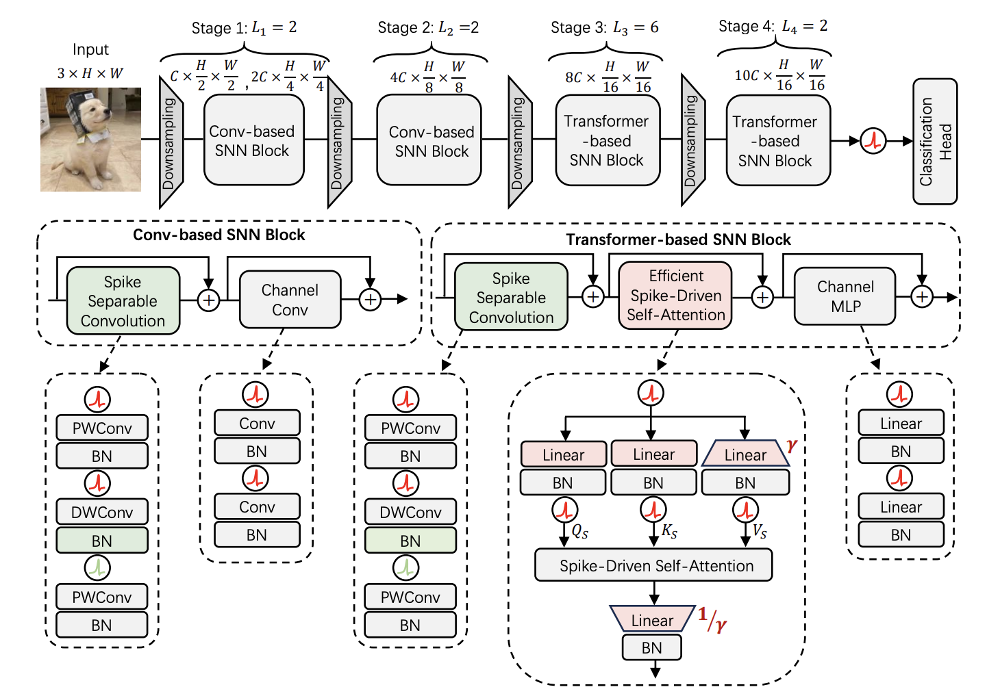
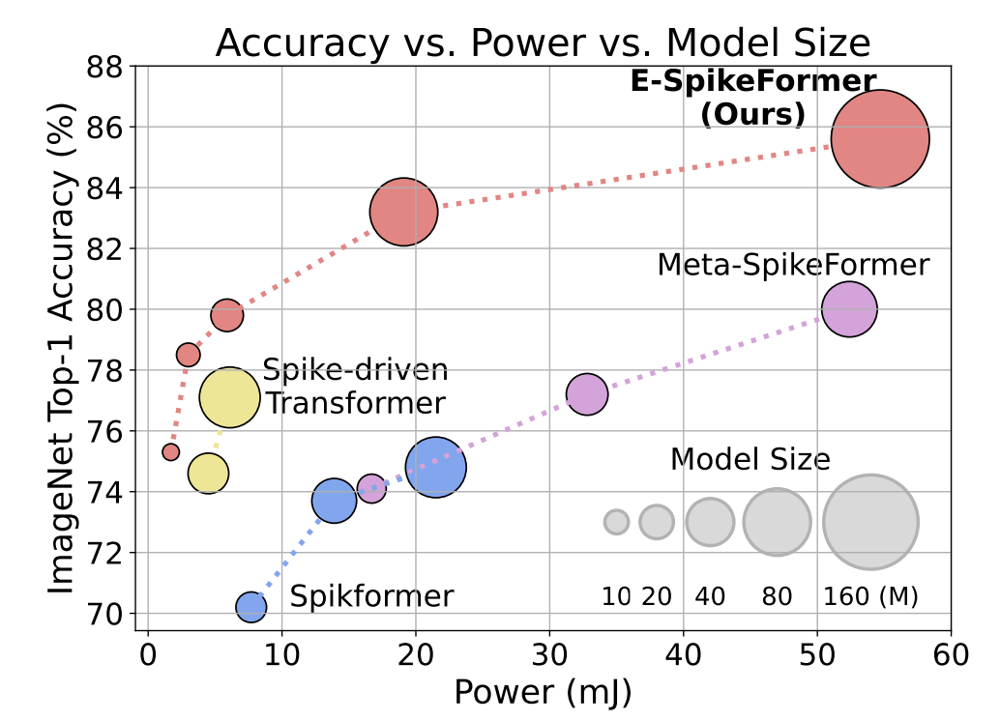

<p align="center">

</p>

# Scaling Spike-driven Transformer with Efficient Spike Firing Approximation Training

[Man Yao*](https://scholar.google.com/citations?user=eE4vvp0AAAAJ), [Xuerui Qiu*](https://scholar.google.com/citations?user=bMwW4e8AAAAJ&hl=zh-CN), [Tianxiang Hu](), [Jiakui Hu](https://github.com/jkhu29), [Yuhong Chou](https://scholar.google.com/citations?user=8CpWM4cAAAAJ&hl=zh-CN&oi=ao), [Keyu Tian](https://scholar.google.com/citations?user=6FdkbygAAAAJ&hl=zh-CN&oi=ao), [Jianxing Liao](), [Luziwei Leng](), [Bo Xu](), [Guoqi Li](https://scholar.google.com/citations?user=qCfE--MAAAAJ&)


*Equal contribution.

BICLab, Institute of Automation, Chinese Academy of Sciences


This repo is the official implementation of [Scaling Spike-driven Transformer with Efficient Spike Firing Approximation Training ](https://arxiv.org/pdf/2411.16061). It currently concludes codes and models for the following tasks:
> **Base Model ImageNet From Scratch**: See [Train_Base.md](SDT_V3/Classification/Model_Base/Train_Base.md).\
> **Large Model ImageNet Pretrain and Finetune**: See [Train_Large.md](SDT_V3/Classification/Model_Large/Model_Large.md).\
> **Object Detection**: See [Detection.md](SDT_V3/Detection/Readme.md).\
> **Semantic Segmentation**: See [Segementation.md](SDT_V3/Segmentation/Readme.md). \
> **DVS**: See [DVS.md](SDT_V3/DVS/Hardvs/Readme.md).


:rocket:  :rocket:  :rocket: **News**:

- **Dec. 19, 2023**: Release the code for training and testing.

## Abstract
The ambition of brain-inspired Spiking Neural Networks (SNNs) is to become a low-power alternative to traditional Artificial Neural Networks (ANNs). This work addresses two major challenges in realizing this vision: the performance gap between SNNs and ANNs, and the high training costs of SNNs. We identify intrinsic flaws in spiking neurons caused by binary firing mechanisms and propose a Spike Firing Approximation (SFA) method using integer training and spike-driven inference. This optimizes the spike firing pattern of spiking neurons, enhancing efficient training, reducing power consumption, improving performance, enabling easier scaling, and better utilizing neuromorphic chips. We also develop an efficient spike-driven Transformer architecture and a spike-masked autoencoder to prevent performance degradation during SNN scaling. On ImageNet-1k, we achieve state-of-the-art top-1 accuracy of 78.5\%, 79.8\%, 84.0\%, and 86.2\% with models containing 10M, 19M, 83M, and 173M parameters, respectively. For instance, the 10M model outperforms the best existing SNN by 7.2\% on ImageNet, with training time acceleration and inference energy efficiency improved by 4.5x and 3.9x, respectively. We validate the effectiveness and efficiency of the proposed method across various tasks, including object detection, semantic segmentation, and neuromorphic vision tasks. This work enables SNNs to match ANN performance while maintaining the low-power advantage, marking a significant step towards SNNs as a general visual backbone.



## Results
We address the performance and training consumption gap between SNNs and ANNs. A key contribution is identifying the mechanistic flaw of binary spike firing in spiking neurons. To overcome these limitations, we propose a Spike Firing Approximation (SFA) method. This method is based on integer training and spike-driven inference, aiming to optimize the spike firing pattern of spiking neurons. Our results demonstrate that optimization the spike firing pattern leads to comprehensive improvements in SNNs, including enhanced training efficiency, reduced power consumption, improved performance, easier scalability, and better utilization of neuromorphic chips. Additionally, we develop an efficient spike-driven Transformer architecture and a spike masked autoencoder to prevent performance degradation during SNN scaling. By addressing the training and performance challenges of large-scale SNNs, we pave the way for a new era in neuromorphic computing.




## Contact Information

```

```

For help or issues using this git, please submit a GitHub issue.

For other communications related to this git, please contact `manyao@ia.ac.cn` and `qiuxuerui2024@ia.ac.cn`.

## Acknowledgement
The pretraining and finetuning of our project are based on [DeiT](https://github.com/facebookresearch/deit), [MCMAE](https://github.com/Alpha-VL/ConvMAE), [Spark](https://github.com/keyu-tian/SparK). and [MAE](https://github.com/facebookresearch/mae). The object detection and semantic segmentation parts are based on [MMDetection](https://github.com/open-mmlab/mmdetection) and [MMSegmentation](https://github.com/open-mmlab/mmsegmentation) respectively. Thanks for their wonderful work.


